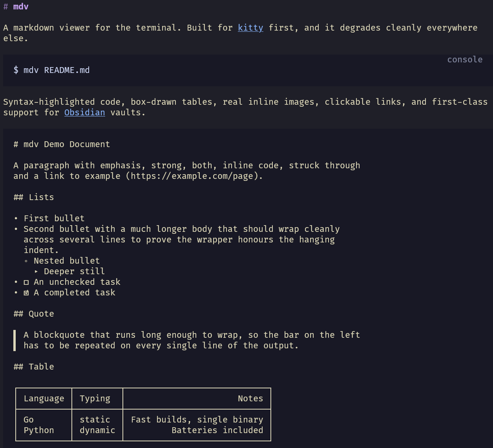

# mdv

A markdown viewer for the terminal. Built for [kitty](https://sw.kovidgoyal.net/kitty/)
first, and it degrades cleanly everywhere else.

```console
$ mdv README.md
```



Syntax-highlighted code, box-drawn tables, real inline images, clickable links,
and first-class support for [Obsidian](https://obsidian.md) vaults.

## Features

- **Full CommonMark + GFM** — tables, task lists, strikethrough, footnotes,
  autolinks.
- **Syntax highlighting** for fenced code, via [chroma](https://github.com/alecthomas/chroma),
  in a palette matched to the surrounding theme.
- **Inline images** using the kitty graphics protocol, with a sixel fallback
  and alt text as a last resort. PNG, JPEG, GIF, WebP, BMP and TIFF.
- **Clickable links** via OSC 8, where the terminal supports them.
- **Obsidian vaults** — `![[embeds]]`, `[[wikilinks]]` and YAML frontmatter.
- **Adapts to your terminal** by asking it what it can do, rather than guessing
  from `TERM`.
- **An interactive pager** — scroll, search, resize, with images that move with
  the text.
- **Safe to pipe.** Output to anything other than a terminal contains no escape
  sequences at all.
- **Safe with untrusted files.** Control characters in a document are shown
  (`␛`), never passed to the terminal, so a hostile README cannot retitle your
  window, rewrite your clipboard, or paint over the screen.
- **Single static binary**, no runtime dependencies.

## Install

### Packages

Each [release](https://github.com/rafael0rueda/markdown_cli/releases) has
static binaries for Linux and macOS on amd64 and arm64, plus packages for the
major Linux families. The packages include the man page.

```sh
sudo dnf install ./mdv-*.x86_64.rpm         # Fedora, RHEL, openSUSE
sudo apt install ./mdv_*_amd64.deb          # Debian, Ubuntu
sudo pacman -U mdv-*-x86_64.pkg.tar.zst     # Arch
```

The tarballs hold the binary, the man page (`mdv.1`), and the license.
`checksums.txt` has a SHA-256 for every file.

### With Go

```sh
go install github.com/rafael0rueda/markdown_cli/cmd/mdv@latest
```

That installs the binary but not the man page.

### From source

```sh
git clone https://github.com/rafael0rueda/markdown_cli
cd markdown_cli
make build                          # ./bin/mdv
sudo make install                   # /usr/local/bin and the man page
make install PREFIX=$HOME/.local    # or just for you, no sudo
```

Building needs Go 1.25 or newer (chroma sets that floor). The binary itself has
no runtime requirements — `CGO_ENABLED=0` throughout, so it runs on any
distribution regardless of its libc.

## Usage

```
mdv [flags] [file...]
```

With no file, or with `-`, mdv reads markdown from standard input.

| Flag | Default | Meaning |
|------|---------|---------|
| `-w`, `-width` | detect | Layout width in columns |
| `-theme` | `auto` | `dark`, `light`, `plain`, `auto` |
| `-color` | `auto` | `none`, `16`, `256`, `truecolor`, `always` |
| `-links` | `auto` | `inline` shows URLs, `hide` shows only link text |
| `-images` | `auto` | `none`, `kitty`, `sixel` |
| `-remote-images` | off | Fetch images over http |
| `-pager` | `auto` | `auto`, `always`, `never` |
| `-frontmatter` | `meta` | `meta`, `hide`, `raw` |
| `-vault` | detect | Obsidian vault root |
| `-no-vault` | off | Do not resolve `[[wikilinks]]` |
| `-ascii` | off | ASCII instead of Unicode box drawing |
| `-caps` | | Report what the terminal supports, and exit |
| `-no-probe` | off | Never query the terminal; use the environment alone |
| `-probe-timeout` | `300ms` | How long to wait for the terminal to answer |
| `-config` | see below | Read defaults from this file |
| `-no-config` | off | Ignore the configuration file |
| `-version` | | Print version and exit |

`man mdv` has the full reference.

### The pager

Run against a terminal, mdv opens an interactive pager. Redirect the output and
it streams the document instead, so pipelines are unaffected. `-pager=never`
turns it off.

| Key | Does |
|-----|------|
| `j` `k`, `↓` `↑` | Scroll a line |
| `d` `u` | Scroll half a screen |
| `space` `b`, `PgDn` `PgUp` | Scroll a screen |
| `g` `G`, `Home` `End` | Jump to the start or end |
| `/` | Search; matches highlight as you type |
| `n` `N` | Next and previous match |
| `Esc` | Cancel the search prompt |
| `q`, `Ctrl-C` | Quit |

Resizing the window re-lays out the document, so wrapping, table widths and
image sizes all follow. The scroll position is kept as a fraction rather than a
line number, because re-wrapping changes how many lines there are and line 200
of the old layout is not line 200 of the new one.

### Piping is safe

When output is not a terminal, mdv emits **no escape sequences at all** — no
color, no hyperlinks, no images. `mdv doc.md > out.txt` gives you plain text.
Use `-color=always` to override. [`NO_COLOR`](https://no-color.org) is honoured.

Width is capped at 100 columns when detected from the terminal, because prose
set much wider is measurably harder to read. `-width` overrides.

### Configuration

Any flag can be given a standing default in `~/.config/mdv/config` (or
`$XDG_CONFIG_HOME/mdv/config`), one per line:

```ini
# ~/.config/mdv/config
theme = light
width = 90
links = inline
ascii
```

The names are the flag names without the dash, and a bare name switches a
boolean flag on. The command line always wins, so `mdv -theme=dark` still
gets the dark theme. A typo is an error naming the line, rather than a setting
that silently does nothing.

`MDV_CONFIG` or `-config` points at a different file, and `-no-config` skips
it.

## Obsidian vaults

mdv reads Obsidian notes with no setup. If a document has a `.obsidian`
directory in one of its parent folders, that folder is treated as a vault and
the syntax plain markdown does not understand starts working:

| Syntax | Rendered as |
|--------|-------------|
| `![[image.png]]` | An inline picture |
| `![[image.png\|300]]` | The same, capped at 300 pixels wide |
| `[[Some Note]]` | A clickable link to the note's file |
| `[[Some Note\|alias]]` | The same, labelled `alias` |
| `[[Some Note#Section]]` | Labelled `Some Note > Section` |

Embed targets are resolved **the way Obsidian resolves them**, which is why
this needs the vault and not just the document: a bare `![[Pasted image 01.png]]`
means *find this in the vault*, and the folder such images are filed into is
`attachmentFolderPath` in `.obsidian/app.json`. mdv checks the attachment
folder, then the note's own folder, then the vault root, then searches the
vault by name, preferring the shallowest match.

A link or embed that resolves to nothing still shows its label. Pointing at a
note you have not written yet is a normal thing to do in a vault, and a missing
attachment should not take the rest of the note down with it.

YAML frontmatter becomes a compact aligned header instead of the two horizontal
rules and stray bullet list that CommonMark makes of it:

```
tags   security, linux
date   2026-09-03
```

Use `-frontmatter=hide` to drop it, or `-frontmatter=raw` to see what a plain
renderer would have done.

## Terminal support

Run `mdv -caps` to see what was detected, and whether it was measured or
inferred. It is the first thing to try when something renders wrongly.

| Terminal | Images | Hyperlinks |
|----------|--------|------------|
| kitty | kitty protocol | yes |
| Ghostty | kitty protocol | yes |
| WezTerm | kitty protocol | yes |
| Konsole | kitty protocol | yes |
| foot | sixel | yes |
| Contour | sixel | yes |
| iTerm2, Alacritty, Windows Terminal, VS Code | — | yes |
| GNOME Terminal (VTE ≥ 0.50) | — | yes |
| xterm and friends | — | — |

Everything degrades: a terminal without graphics shows alt text, one without
OSC 8 shows the URL in parentheses, and one without color gets plain text.

Nothing is probed inside **tmux or screen** — the multiplexer intercepts the
replies, and graphics need passthrough wrapping that is not implemented yet.
mdv reports the environment's view and says so.

## How it works

A few decisions that are not obvious from the outside:

**The renderer does not produce a string.** It produces a `Doc`: a flat slice
of lines, each a sequence of styled runs. Serializing to a pipe walks it once,
but the interactive pager needs to draw an arbitrary window of it repeatedly,
and to know which screen row a given image lands on.

**Colors degrade by hue, not by RGB distance.** On a 16-color terminal, nearest
by distance collapses almost every pastel onto white — technically the closest
match, and unreadable. Mapping to the nearest *hue* keeps headings, links and
code distinguishable.

**Terminal capabilities are measured, not guessed.** mdv writes a short string
of queries and reads the replies. Primary device attributes goes last on
purpose: every terminal answers it, so its reply marks the point where the
earlier queries have been processed. Without that terminator there is no way to
tell "does not support graphics" from "has not replied yet". Queries go to
`/dev/tty`, so this works even when stdin and stdout are both redirected.

**Image rows are reserved before the picture is drawn.** mdv writes the blank
lines, moves the cursor back up, and draws over them. That forces any scrolling
to happen up front, so the image cannot be scrolled halfway off the screen as
it lands.

**Blocks are split at images on their own source line.** Markdown runs a
paragraph until a blank line, so a sentence followed by an embed on the next
line is a *single* paragraph — and rendering it as one block would strand the
picture mid-sentence.

**Images are prepared once and drawn many times.** The costly work — decoding,
scaling, and for sixel a median cut and a dither — depends only on the picture,
not on where it sits. The pager redraws on every scroll step, so a kitty image
is transmitted once and each frame afterwards is a short placement command
rather than a fresh base64 copy of the file.

**An image half off the screen is cropped, not skipped.** Scrolling through a
picture is continuous rather than having it appear and disappear whole. The
pager thinks in rows and the protocols think in pixels, so the row range is
converted against the prepared height.

## Development

```sh
make test           # go test ./...
make race           # under the race detector
make lint           # fmt, vet, test
make golden         # regenerate golden files after a layout change
make man            # preview the man page
make dist           # static binaries for linux and darwin, amd64 and arm64
make snapshot       # every release artifact, unpublished (needs goreleaser)
```

**Releasing** is pushing a tag. `git tag v0.2.0 && git push origin v0.2.0` runs
the release workflow, which tests, then builds the archives and packages with
[GoReleaser](https://goreleaser.com) and publishes them. CI builds the same
artifacts on every push without publishing them, so a broken package shows up
before the tag does.

The man page and the README are checked against the code: a test fails if
either is missing a flag, and another runs the man page through `groff` to
catch markup mistakes.

Two testing approaches worth knowing about, since both cover things that are
otherwise hard to check without a terminal:

- **The sixel encoder is verified by round-trip.** The tests contain a sixel
  decoder, so encoded output is decoded again and compared against the source.
  Asserting on the shape of the escape sequence would only confirm it looks
  plausible; decoding it confirms it means the right thing.
- **The capability probe is driven against a real pseudo-terminal**, with a
  fake terminal answering on the other end. That covers raw mode, the read
  timeout, replies arriving in fragments, and restoring the terminal to its
  original state. Those tests are Linux-only and skip elsewhere.
- **The pager is tested through a pseudo-terminal too**, with a small terminal
  emulator interpreting what it draws. The pager positions the cursor rather
  than writing a stream of text, so stripping the escape sequences would run
  every row together; interpreting them into a grid lets the tests ask what is
  actually on screen.

### Layout

```
cmd/mdv/            flag parsing, the config file, input dispatch
internal/render/    markdown -> a line-addressed document of styled runs
internal/theme/     colors, styles, palettes, glyph sets
internal/term/      terminal capability detection and probing
internal/graphics/  decoding, scaling, and the kitty and sixel protocols
internal/vault/     Obsidian vault detection and wikilink resolution
internal/pager/     the interactive viewer
internal/settings/  the configuration file format
docs/               the man page and screenshots
.goreleaser.yaml    release archives and Linux packages
```

## Status

Working and usable.

## Prior art

[`mdcat`](https://github.com/swsnr/mdcat) does markdown with kitty graphics in
Rust, and [`glow`](https://github.com/charmbracelet/glow) is an excellent Go
markdown renderer without inline images. mdv differs mainly in the Obsidian
support and in measuring terminal capabilities rather than inferring them.

## License

[MIT](LICENSE) © Rafael Rueda.

The dependencies are all permissively licensed too — goldmark, chroma, uniseg
and regexp2 under MIT, and the `golang.org/x` packages under BSD-3-Clause.
